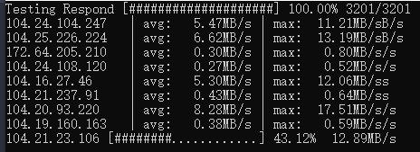

# better-cloudflare-scanner

基于`python3`,使用自带`requests`与`ThreadPoolExecutor`,可直接运行,高效

根据响应时间筛选ip,然后再测试速度选出最佳节点

---

运行`test.py`开始测试

请按照实际情况修改`config.py`以找到更好的ip

运行截图:



运行后结果到处至`result.csv`

```csv
IP              , Respond , Avg(MB/s), Max(MB/s)
104.20.93.220   , 378.63  , 8.28  , 17.51 
104.25.226.224  , 374.50  , 6.62  , 13.19 
104.24.104.247  , 371.85  , 5.47  , 11.21 
104.16.27.46    , 376.65  , 5.30  , 12.06 
104.20.179.1    , 380.42  , 4.58  , 12.61 
104.17.241.174  , 381.92  , 4.08  , 11.48 
172.67.117.90   , 380.22  , 0.60  , 1.38  
104.21.237.91   , 378.43  , 0.43  , 0.64  
104.19.160.163  , 379.76  , 0.38  , 0.59  
172.64.205.210  , 375.67  , 0.30  , 0.80  
```